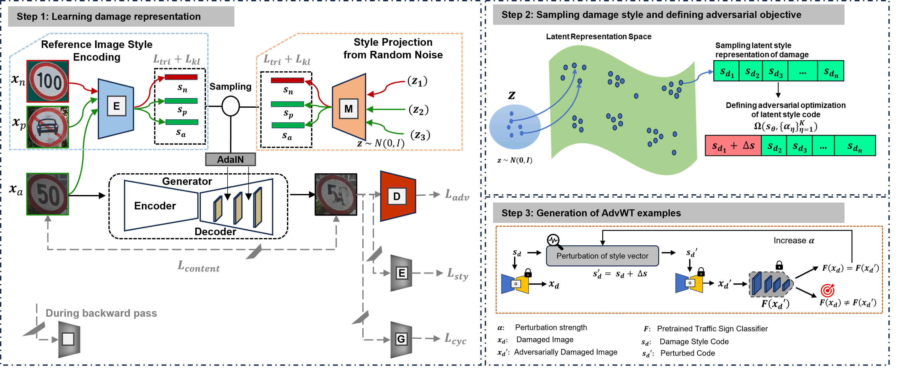
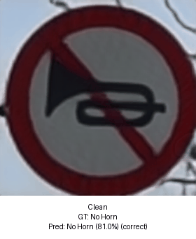

# Adversarial Wear and Tear: Exploiting Natural Damage for Generating Physical-World Adversarial Examples
Authors: Samra Irshad<sup>1</sup>, Seungkyu Lee<sup>1</sup>, Nassir Navab<sup>2</sup>, Hong Joo Lee<sup>2</sup>, and Seong Tae Kim<sup>1</sup>.

<small>
<sup>1</sup> School of Computing, Kyung Hee University, Yongin-si, South Korea

<sup>2</sup> Technical University of Munich, Germany
<small>

This is the official implementation of our paper: https://arxiv.org/abs/2503.21164

## Abstract
The presence of adversarial examples in the physical world poses significant challenges to the deployment of Deep Neural Networks (DNNs) in safety-critical applications such as autonomous driving, where even minor misclassifications can lead to catastrophic consequences. Most existing methods for crafting physical-world adversarial examples are ad-hoc and deliberately designed, relying on temporary modifications like shadows, laser beams, or stickers that are tailored to specific scenarios. In this paper, we introduce a new class of physical-world adversarial examples, *AdvWT*, which draws inspiration from the naturally occurring phenomenon of 'wear and tear', an inherent property of physical objects. Unlike manually crafted perturbations, 'wear and tear' emerges organically over time due to environmental degradation, as seen in the gradual deterioration of outdoor signboards. To achieve this, *AdvWT* follows a two-step approach. First, a GAN-based, unsupervised image-to-image translation network is employed to model these naturally occurring damages, particularly in the context of outdoor signboards. The translation network encodes the characteristics of damaged signs into a latent `damage style code'. In the second step, we introduce adversarial perturbations into the style code, strategically optimizing its transformation process. This manipulation subtly alters the damage style representation, guiding the network to generate adversarial images where the appearance of damages remains perceptually realistic, while simultaneously ensuring their effectiveness in misleading neural networks. Through comprehensive experiments on two traffic sign datasets, we show that *AdvWT* effectively misleads DNNs in both digital and physical domains. *AdvWT* achieves an effective attack success rate, greater robustness, competitive transferrability, and a more natural appearance compared to existing physical-world adversarial examples. Additionally, integrating *AdvWT* into training enhances a model's generalizability to real-world damaged signs.

## Method Overview
<!-- centered, fixed width, clickable to full-res -->
<p align="center">
  <a href="method_overview.png">
    
  </a>
  <br>
</p>

## Demonstration of Adversarial Wear-and-Tear (AdvWT)
<!-- centered, fixed width, clickable to full-res -->
<p align="center">
  
  <br>
  <em>Clean → adversarial transitions with predictions.</em>
</p>

## Setup
- **Get code**
```bash
git clone https://github.com/samra-irshad/AdvWT.git
```
- **Build environment**
```bash
cd AdvWT
# use anaconda to build environment 
conda create -n AdvWT python=3.7
conda activate AdvWT
```
- **Download Dataset**
  - Download the unpaired clean and damaged traffic sign dataset [Google](https://drive.google.com/file/d/1EoVeprcNQZtuT-66OKS2RoR_rtBt7ZR5/view?usp=drive_link)
  - To request access, email me at [samra@khu.ac.kr] or click **Request access** on the Drive page.
  - I will grant access to the account you provide.

- **Download pretrained traffic sign recognition model checkpoints**
  - Pretrained traffic recognition models are available for download at [Hugging Face](https://huggingface.co/sam-ir/Advwt-target-models)
 
- **Download pretrained clean-to-damage traffic sign translation model checkpoints**
  - Pretrained clean-to-damage traffic sign translation model is available for download at [Hugging Face](https://huggingface.co/sam-ir/Advwt-target-models)
 
## Quick Start
   - Insert the paths of checkpoints and test set main_attack.py to test our attack:
```bash
python main_attack.py --checkpoint /path/to/ckpt.pth --input_test /path/to/test
```

## Acknowledgements
This code is based on the [StarGAN v2](https://github.com/clovaai/stargan-v2) and [SmoothLatentSpace](https://github.com/yhlleo/SmoothingLatentSpace). Thanks to the contributors of this project.

## Citation
```bash
@article{irshad2025adversarial,
  title={Adversarial Wear and Tear: Exploiting Natural Damage for Generating Physical-World Adversarial Examples},
  author={Irshad, Samra and Lee, Seungkyu and Navab, Nassir and Lee, Hong Joo and Kim, Seong Tae},
  journal={arXiv preprint arXiv:2503.21164},
  year={2025}
}
```
If you have any questions, please contact me without hesitation (samra AT khu.ac.kr).

